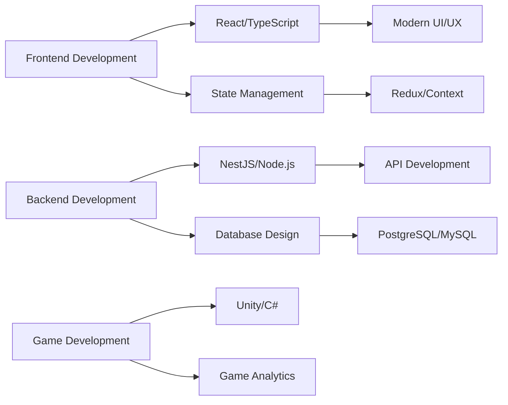

<div align="center">

<!-- Profile Image -->


<br>

<!-- Animated Header -->


<br>
<br>

<!-- Badges -->
<div align="center">

[](https://github.com/Shubnechkin-git)
[](https://wakatime.com/@018d404d-ac1a-4b76-bcf9-a2bd89cec2ba)
[](https://github.com/Shubnechkin-git)

</div>

<!-- Trophy -->
[](https://github.com/ryo-ma/github-profile-trophy)

</div>

---

## 👨‍💻 Обо мне

```typescript
const shubnechkin = {
  name: "Shubnechkin",
  role: "Full Stack Developer",
  location: "Russia",
  currentFocus: "Портал контрагентов",
  learning: ["NestJS", "React", "TypeScript", "Advanced Patterns"],
  interests: ["Game Development", "Web Development", "Tech Innovation"],
  funFact: "Люблю создавать игры и анализировать их метрики 🎮",
  contact: {
    email: "d.n.shubnikov@gmail.com",
    vk: "vk.com/shubnechkin",
    instagram: "@main_shubnechkin"
  }
};
```

---

## 🚀 Технологический стек

### 💻 Языки программирования


### 🎨 Frontend


### ⚙️ Backend


### 🗄️ Базы данных


### 🛠️ Инструменты и DevOps


### 🎮 Game Development


---

## 📊 Статистика GitHub

<div align="center">

<!-- GitHub Stats with custom theme -->


<!-- GitHub Streak -->


<!-- Activity Graph -->


<!-- WakaTime Stats -->


</div>

---

## 🎯 Мои проекты

### 🔥 Избранные проекты

<div align="center">

#### 🏢 Портал контрагентов

**Full Stack приложение для управления контрагентами и заявками**

<table>
<tr>
<td width="50%" valign="top">

**Frontend Stack**  
🔹 React + TypeScript  
🔹 Vite + Redux  
🔹 Tailwind CSS

</td>
<td width="50%" valign="top">

**Backend Stack**  
🔹 NestJS + TypeScript  
🔹 PostgreSQL + Redis  
🔹 Bull Queue

</td>
</tr>
<tr>
<td colspan="2" align="center">

**Features**: Real-time обновления, WebSocket, Email уведомления, OCR обработка

</td>
</tr>
</table>

</div>

---

### 🎮 Игры

<div align="center">

<a href="https://game-analytics.ru/yg/developer/shubnechkin-81905">
  
</a>

**Профиль разработчика игр** с аналитикой и метриками

</div>

---

### 👥 Сообщество

<div align="center">

<a href="https://vk.com/shubnechkin_dev">
  
</a>

**Сообщество разработчиков** в ВКонтакте

</div>

---

## 💼 Опыт работы



---

## 🎓 Обучение и развитие

<div align="center">

### 📚 Изучаю сейчас


</div>

---

## 🔗 Связаться со мной

<div align="center">

[](https://instagram.com/main_shubnechkin)
[](https://www.youtube.com/c/shubnechkin)
[](https://vk.com/shubnechkin)
[](mailto:d.n.shubnikov@gmail.com)
[](https://github.com/Shubnechkin-git)

</div>

---

## 💡 Интересные факты

<div align="center">

### 🎯 Мои принципы разработки

<table>
<tr>
<td width="50%" valign="top" align="center">

✨ **Чистый код**  
*Читаемость превыше всего*

🚀 **Производительность**  
*Оптимизация на каждом этапе*

🔒 **Безопасность**  
*Защита данных в приоритете*

</td>
<td width="50%" valign="top" align="center">

📱 **UX/UI**  
*Пользовательский опыт на первом месте*

🧪 **Тестирование**  
*Качество через тесты*

💡 **Инновации**  
*Постоянное изучение новых технологий*

</td>
</tr>
</table>

</div>

---

## 📈 Вклад в Open Source

<div align="center">


</div>

---

## ☕ Поддержка

<div align="center">

### Если вам нравится моя работа, вы можете поддержать меня:

[](https://www.buymeacoffee.com/shubnechkin)
[](https://ko-fi.com/shubnechkin)

</div>

---

## 🎨 Рандомная цитата

<div align="center">


</div>

---

<div align="center">

### ⚡ "Код — это поэзия, написанная на языке машин"

**⭐️ От звездочки на репозитории не убудет, а мне будет приятно!**

**Спасибо за визит! 🚀**

</div>

